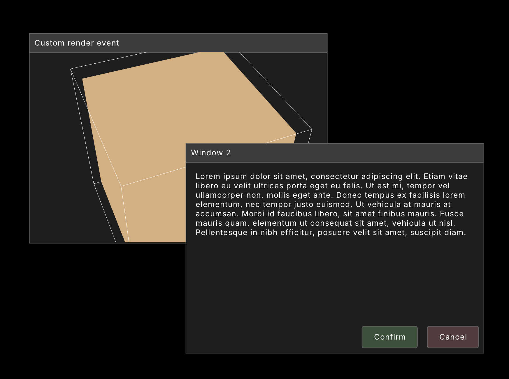
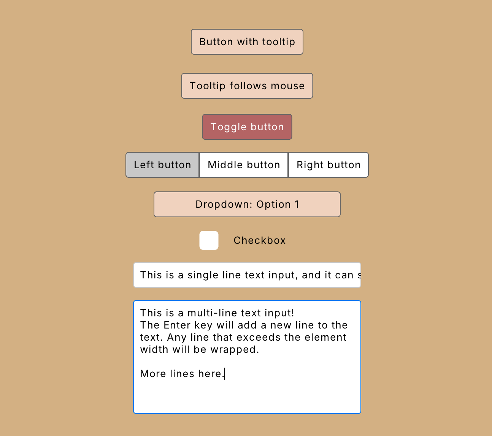

# orui


orui is an immediate mode UI library for odin and raylib, with support for flex layouts.

It is meant for building user-facing UIs using familiar concepts from CSS.

orui is a work in progress.





Features:

- Flex layout
	- Fit (shrink) and grow
	- Justify and align
	- Child gap
- Grid layout
	- Auto rows/columns
	- Fixed rows/columns
	- Flow direction
	- Column/row gaps
	- Column/row spans
	- Column/row sizes
- Absolute and relative positioning
- Layers (z-index)
- Padding, margin, borders, rounded corners, overflow
- Images (textures)
  - Alignment
	- Content fit (fill, contain, cover, none, scale-down)
- Text
  - Line height
  - Letter spacing
  - Wrapping
  - Alignment

To do:

- Flex wrap
- Text inputs
- 9-slice scaling
- Grid justify/align
- Scroll views (maybe)
- Other widgets (maybe)
- Grid row/column start (maybe)

## Table of Contents

- [Usage](#usage)
- [Declaring UI](#declaring-ui)
  - [element](#element)
  - [container](#container)
  - [label](#label)
  - [image](#image)
- [Other functions](#other-functions)
  - [hovered()](#hovered)
  - [active()](#active)
  - [clicked()](#clicked)
- [Element config](#element-config)
  - [Config helpers](#config-helpers)
  - [Config modifiers](#config-modifiers)

## Usage

Allocate the orui Context up front:

```odin
ctx := new(orui.Context)
```

In your render loop:

```odin
for !rl.WindowShouldClose() {
	rl.BeginDrawing()
	orui.begin(ctx, width, height)

	// Declare UI here

	orui.end() // The UI gets rendered here
	rl.EndDrawing()
}
```

## Declaring UI

### element

`element` is the basic building block of orui. It can be used to build anything that orui can render.

All elements declared after will be attached as children, until `end_element()` is called:

```odin
orui.element(orui.id("container"), config)

// children declared here

orui.end_element()
```

You can use this to build your own elements:

```odin
my_element :: proc(id: string) {
  orui.element(orui.id(id), {...})
  orui.label(...)
  orui.end_element()
}

@(deferred_none=orui.end_element)
my_container :: proc(id: string) {
  orui.element(orui.id(id), {...})
}

{my_container("test")
  my_element("element 1")
}
```

### container

`container` is exactly like `element` except it automatically ends the element when it goes out of scope. You should not manually call `end_element()` for containers.

This means you must use curly braces to define the scope of the container:

```odin
{orui.container(orui.id("element ID"), config)
  // declare children inside curly brackets
}
```

Or if you prefer another style:
```odin
if (orui.container(orui.id("element ID"), config)) {
  // declare children
}
```

Make sure containers always have their own scope. In the following example, label 2's parent is container B, not container A.

```odin
{
  orui.container(orui.id("container A"), config)
  orui.label(orui.id("label 1"), label1, {}) // child of container A
  orui.container(orui.id("container B"), config) // new container is child of container A
  // all elements from here to end of scope will be children of container B
  orui.label(orui.id("label 2"), label1, {}) // child of container B
}
```

### label

A label element displays text.

Text will wrap by default. Set the `overflow` option if you want change this behaviour.

Make sure you define the font and font size in the element config.

This element does not need the surrounding curly braces because it cannot hold child elements.

```odin
orui.label(orui.id("label"), "Hello world!", {
	font = &your_font,
	font_size = 16,
})
```

A label element can also be used as a button by changing its style when the user interacts with it:

```odin
if orui.label(orui.id("button"), "Button text", {
  background_color = orui.active() ? {100, 100, 100, 255} : orui.hovered() ? {120, 120, 120, 255} : {30, 30, 30, 255},
}) {
  // handle button click
}
```

### image

Display an image. Takes a pointer to a raylib Texture2D.

This element does not need the surrounding curly braces because it cannot hold child elements.

```odin
orui.image(orui.id("image"), &texture, {
	color = rl.WHITE, // optional tint
	texture_source = rl.Rectangle{}, // optional, draw part of the texture
})
```

## Other functions

### hovered()

Returns true if the mouse is hovering over the current element. Should be used inside element declarations only:

```odin
orui.label(orui.id("label"), "Test", {
  background_color = orui.hovered() ? rl.RED : rl.BLACK
})
```

If you want to check the hover state of an element oustide of the element declaration, you can pass the element ID into the hovered function:

```odin
if orui.hovered("label") {
  // mouse is over the element
}
```

### active()

Returns true if the element is active (mouse down on the element). If the mouse moves off the element while the mouse is down, the element will become inactive.

```odin
orui.label(orui.id("label"), "Test", {
  background_color = orui.active() ? rl.RED : rl.BLACK
})
```

Same as the hover function, you can ask about a specific element by passing in the ID:

```odin
if orui.active("label") {
  // label is active
}
```

### clicked()

Returns true if the element has been clicked. A click is only triggered if the element was both hovered and active when the mouse was released. This means dragging the mouse off an element will cancel the click.

```odin
orui.label(orui.id("label"), "Test", {
  background_color = orui.clicked() ? rl.RED : rl.BLACK
})
```

Same as the above two functions, you can ask about a specific element by passing in the ID:

```odin
if orui.clicked("label") {
  // label was clicked
}
```

## Element config

The element functions take an element config where you can set any of these fields:

```odin
ElementConfig :: struct {
	// layout
	layout:           Layout,
	direction:        LayoutDirection,
	position:         Position,
	width:            Size,
	height:           Size,
	padding:          Edges,
	margin:           Edges,
	gap:              f32,
	align_main:       MainAlignment,
	align_cross:      CrossAlignment,
	overflow:         Overflow,
	layer:             int,

	// grid
	cols:             int,
	col_sizes:        []Size,
	rows:             int,
	row_sizes:        []Size,
	col_gap:          f32,
	row_gap:          f32,
	col_span:         int,
	row_span:         int,

	// style
	color:            rl.Color,
	background_color: rl.Color,
	border_color:     rl.Color,
	corner_radius:    Corners,

	// text
	has_text:         bool,
	text:             string,
	font:             ^rl.Font,
	font_size:        f32,
	letter_spacing:   f32,
	line_height:      f32,

	// texture
	has_texture:      bool,
	texture:          ^rl.Texture2D,
	texture_source:   rl.Rectangle,
	texture_fit:      TextureFit,

	// content layout
	align:            [2]ContentAlignment,

	// input
	disabled:         InheritedBool,
	block:            InheritedBool,
	capture:          InheritedBool,
}
```

### layout
```odin
Layout :: enum {
	Flex,  // Default. Automatically positions children.
	Grid,  // Position children within a grid with fixed number of columns and/or rows.
	None,  // Does not affect children positioning.
}
```

### direction

Only relevant if the layout is set to Flex.

```odin
LayoutDirection :: enum {
	LeftToRight,  // Default
	TopToBottom,
}
```

### position

```odin
PositionType :: enum {
	Auto,      // Default. Positioned by flex/grid parent. Don't use this if parent is not flex or grid.
	Absolute,  // Unaffected by parent position or place in UI tree.
	Relative,  // Positioned relative to its parent's position.
}
Position :: struct {
	type:  PositionType,
	value: rl.Vector2,
}
```

### width and height

```odin
SizeType :: enum {
	Fit,      // Element will try to fit its children
	Grow,     // Element will try to take up all extra space
	Percent,  // Element will be a percentage size of its parent
	Fixed,    // Element size will be a fixed number of pixels
}
Size :: struct {
	type:  SizeType,
	value: f32,
	min:   f32,
	max:   f32,
}
```

### padding and margin

Define pixel padding/margin for each side of the element.

```odin
Edges :: struct {
	top:    f32,
	right:  f32,
	bottom: f32,
	left:   f32,
}
```

### border

Define the border width for each side of the element.

```odin
Edges :: struct {
	top:    f32,
	right:  f32,
	bottom: f32,
	left:   f32,
}
```

### gap

The space between child elements in pixels. Only used for elements with a flex or grid layout.

### align_main

Flex alignment along the main axis. Same as justify-content in css.

Main axis is the axis following the direction of the flex element.
If direction is `LeftToRight`, main axis is horizontal.
if direction is `TopToBottom`, main axis is vertical.

```odin
MainAlignment :: enum {
	Start,         // Align children to beginning of element
	End,           // Align children to end of element
	Center,        // Center the children
	SpaceBetween,  // Distribute children with equal space between them, no space at edges
	SpaceAround,   // Distribute children with equal space around each item
	SpaceEvenly,   // Distribute children with equal space between them and edges
}
```

### align_cross

Flex alignment along the cross axis. Same as align-items in css.

```odin
CrossAlignment :: enum {
	Start,   // Align children to beginning of element
	End,     // Align children to end of element
	Center,  // Center the children
}
```

### overflow

Control how an element handles its content overflowing its size.

- **Wrap**: overflowing content will wrap around. This is the default.
- **Visible**: content will overflow the container.

```odin
Overflow :: enum {
	Wrap,
	Visible,
}
```

### layer

Layer controls the render order of elements. Set this to ensure an element renders on top of or below other elements.

The root layer starts at layer 1. If you don't define the element's layer, it will be placed in the same layer as its parent.

Elements in the same layer are drawn in the order in which the elements were declared.

### cols, rows

Set the number of columns and rows for a grid layout. Only used if the layout is set to `.Grid`.

Both are optional but usually you want to set at least one of these.

The maximum number of columns/rows is 12. This is a constant defined as `MAX_GRID_TRACKS` in `orui.odin`. You can adjust this if needed but it will affect memory usage significantly. Before changing this, remember that grid cells can contain flex layouts and grids inside them as well, and that can probably handle your use case.

### col_sizes, row_sizes

Defines the size of each column (width) and row (height). This is passed in as a slice of Size structs.

The slice length does not need to match your grid size. Any columns or rows that don't have a defined size will use the size of the last column/row.

This means if you want equal widths for all columns/rows, you only need to set the first column's size. For example:

```odin
orui.container(orui.id("grid"), {
	layout = .Grid,
	cols = 5,
	rows = 5,
	col_sizes = []{orui.grow()},
	row_sizes = []{orui.fixed(250)},
})
```

### col_gap, row_gap

Set the gap between columns and rows. If missing, defaults to the `gap` option.

### col_span, row_span

Set a cell to span multiple rows and columns.

### color

Foreground color given as a raylib Color. Used for text color if there is text, and texture tint if there is a texture.

### background_color

The background color of the element, given as a raylib Color.

If the alpha is 0, nothing is drawn. Default background color is invisible.

### border_color

The color of the border, given as a raylib Color.

If the alpha is 0, nothing is drawn. Default border color is invisible.

### corner_radius

The radius of each corner. Will be applied to both backgrounds and borders.

Does not apply to content (labels, images).

```odin
Corners :: struct {
	top_left:     f32,
	top_right:    f32,
	bottom_right: f32,
	bottom_left:  f32,
}
```

### has_text and text

If `text` is set, `has_text` should be set to true. The label element does this automatically.

If `text` is set, a raylib font must also be defined, and a font size.

### font

This is a raylib Font pointer. orui does not manage your fonts for you. It's up to you to pass the correct font pointer for your font size.

### font_size

Font size in pixels.

### letter_spacing and line_height

Control the letter spacing and line height of the text.

Default value is 1 for both.

### has_texture and texture

If `texture` is set, `has_texture` should be set to true. The image element does this automatically.

`texture` is a raylib Texture2D pointer.

### texture_source

Set this to draw a portion of the texture instead of the whole texture.

### texture_fit

Controls how the texture resizes to fit its container.

```odin
TextureFit :: enum {
	Fill,       // Image will be stretched or squashed to fill the container.
	Contain,    // Keeps its aspect ratio, and resizes to fit the container.
	Cover,      // Keeps its aspect ratio, and resizes to fill the container. Image may be clipped.
	None,       // Image is not resized.
	ScaleDown,  // Same as contain but only scales down, never up.
}
```

### align

Controls how the content is aligned. Only relevant for elements with an image or text. Does not affect children.

An array of two alignment values. The first value is the horizontal alignment, second value is vertical alignment.

```odin
ContentAlignment :: enum {
	Start,   // Align left/top
	Center,  // Align center
	End,     // Align right/bottom
}
```

### disabled, block, capture

These are mouse input options. If omitted, the element will inherit the values from its parent element.

Disabled: whether the element can be interacted with. If disabled, it won't ever receive the hovered or active states. Default value is False.

Block: whether the element will consume mouse interactions, block elements below it from receiving them. Default value is True.

Consume: whether the element will consume interactions once they are activated. Recommended to be set to True for things like sliders and draggable windows. Default value is False.

```odin
InheritedBool :: enum {
	Inherit,
	False,
	True,
}
```

### Config helpers

Config helpers can be used in the element config as a shortcut for common values:

```odin
orui.container(orui.id("container"), {
	// equal padding on all sides, equivalent to {5, 5, 5, 5}
	padding = orui.padding(5),
	// horizontal padding of 10, vertical padding of 5, equivalent to {5, 10, 5, 10}
	padding = orui.padding(10, 5),

	// equal margin on all sides, equivalent to {5, 5, 5, 5}
	margin = orui.margin(5),
	// horizontal margin of 10, vertical margin of 5, equivalent to {5, 10, 5, 10}
	margin = orui.margin(10, 5),

	// equal border width on all sides, equivalent to {2, 2, 2, 2}
	border = orui.border(2),

	// equal radius on all corners, equivalent to {5, 5, 5, 5}
	corner_radius = orui.corner(5),

	// fixed pixel size, equivalent to {.Fixed, 500, 0, 0}
	width/height = orui.fixed(500),

	// percent size, equivalent to {.Percent, 0.5, 0, 0}
	width/height = orui.percent(0.5),

	// fit size, equivalent to {.Fit, 0, 0, 0}
	width/height = orui.fit(),

	// grow size, equivalent to {.Grow, weight, 0, 0}. Weight is optional
	width/height = orui.grow(weight),
})
```

### Config modifiers

The container and label also take optional config modifiers, which are functions with this signature:

```odin
ElementModifier :: proc(element: ^Element)
```

The modifiers will be called to configure the element further.

This can be useful for reusable styles:

```odin
error_style :: proc(element: ^Element) {
  element.background_color = rl.RED
  element.color = rl.WHITE
}

standard_sizing :: proc(element: ^Element) {
  element.padding = {5, 10, 5, 10}
  element.margin = {5, 10, 5, 10}
}

{
  orui.container(orui.id("container"), {}, error_style, standard_sizing)
  orui.label(orui.id("label"), {}, error_style)
}
```
