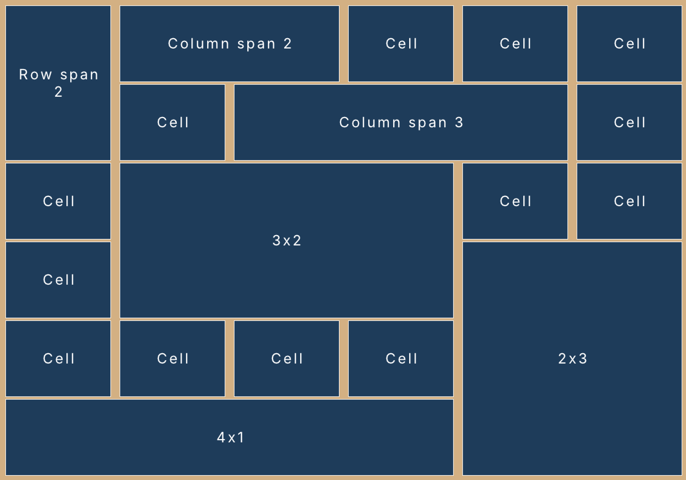

# orui


orui is an immediate mode UI library for odin and raylib, with support for flex and grid layouts.

It is meant for building user-facing UIs using familiar concepts from CSS.

orui is a work in progress. **Requires odin 2025-09 release or newer!**




Features:

- Flex layout
  - Fit (shrink) and grow
  - Justify and align
  - Child gap
  - Flex wrap (horizontal wrap only)
- Grid layout
  - Auto rows/columns
  - Fixed rows/columns
  - Flow direction
  - Column/row gaps
  - Column/row spans
  - Column/row sizes
- Absolute, relative and fixed positioning
  - Anchor and origin
- Layers (z-index)
- Padding, margin, borders, rounded corners, overflow, clipping
- Scroll (with mouse wheel)
  - Horizontal/vertical scrollbars
- Images (textures)
  - Alignment
  - Content fit (fill, contain, cover, none, scale-down)
- Text
  - Line height
  - Letter spacing
  - Wrapping
  - Alignment
- Text inputs
  - Click, move with arrow keys, home+end, insert, backspace, select all
  - Single line and multi line
  - Mouse and keyboard text selection
  - Copy/cut/paste
- Custom render events
  - Interleave your own rendering with the UI

To do:

- 9-slice scaling
- Grid justify/align
- Text inputs
  - Character filtering
  - Double click, triple click
  - Undo/redo (maybe)
  - Drag and drop (maybe)
  - Placeholder (maybe)
  - Customise text select background colour
- Other widgets (maybe)
  - Slider
- Grid row/column start (maybe)
- Scroll with drag
- Scroll momentum
- Scroll bounce

## Table of Contents

- [Usage](#usage)
- [Declaring UI](#declaring-ui)
  - [element](#elementid-config-modifiers)
  - [container](#containerid-config-modifiers)
  - [label](#labelid-text-config-modifiers)
  - [text_input](#text_inputid-buffer-config-modifiers)
  - [image](#imageid-config-modifiers)
  - [scrollbar](#scrollbarparent_id-background_config-handle_config-index--0)
- [Other functions](#other-functions)
  - [hovered()](#hovered)
  - [active()](#active)
  - [clicked()](#clicked)
	- [focused()](#focused)
- [Element config](#element-config)
  - [Config helpers](#config-helpers)
  - [Config modifiers](#config-modifiers)
- [Custom render events](#custom-render-events)

## Usage

Allocate the orui Context up front and initialize:

```odin
ctx := new(orui.Context)
orui.init(ctx)
defer orui.destroy(ctx)
```

(Optional) Set a default font:

```odin
ctx.default_font = rl.GetFontDefault()
```

If you don't set a default font, you must pass a font to each element that displays text. The default font is a fallback for when the element font is missing.

In your render loop:

```odin
for !rl.WindowShouldClose() {
	rl.BeginDrawing()
	orui.begin(ctx, width, height)

	// Declare UI here

	render_commands := orui.end()

	for render_command in render_commands {
		// optional: use orui's built-in helper
		orui.render_command(render_command)
		// important: the built-in renderer uses the temp allocator when rendering strings!
		// remember to free the temp allocator at the end of each frame, or implement your
		// own renderer
	}

	rl.EndDrawing()
}
```

## Declaring UI

### Element IDs

Every element should have a unique ID. You can create the ID in 3 ways:

```odin
// String:
orui.id("container")
// String literals will be hashed at compile time.

// String + index:
orui.id("row", i)

// Int (fastest, no hashing):
orui.id(1000000)
```

`orui.id` should ALWAYS be called inside element declarations, because it has side effects. If you only want to generate an ID, use `to_id` instead:

```odin
orui.to_id("row", i)
```

### element(id, config, ..modifiers)

`element` is the basic building block of orui. It can be used to build anything that orui can render.

All elements declared after will be attached as children, until `end_element()` is called:

```odin
orui.element(orui.id("container"), config)

// children declared here

orui.end_element()
```

You can use this to build your own elements:

```odin
my_element :: proc(id: string) {
  orui.element(orui.id(id), {...})
  orui.label(...)
  orui.end_element()
}

@(deferred_none=orui.end_element)
my_container :: proc(id: string) {
  orui.element(orui.id(id), {...})
}

{my_container("test")
  my_element("element 1")
}
```

### container(id, config, ..modifiers)

`container` is exactly like `element` except it automatically ends the element when it goes out of scope. You should not manually call `end_element()` for containers.

This means you must use curly braces to define the scope of the container:

```odin
{orui.container(orui.id("element ID"), config)
  // declare children inside curly brackets
}
```

Or if you prefer another style:
```odin
if (orui.container(orui.id("element ID"), config)) {
  // declare children
}
```

Make sure containers always have their own scope. In the following example, label 2's parent is container B, not container A.

```odin
{
  orui.container(orui.id("container A"), config)
  orui.label(orui.id("label 1"), label1, {}) // child of container A
  orui.container(orui.id("container B"), config) // new container is child of container A
  // all elements from here to end of scope will be children of container B
  orui.label(orui.id("label 2"), label1, {}) // child of container B
}
```

### label(id, text, config, ...modifiers)

A label element displays text.

Text will wrap by default. Set the `overflow` option if you want change this behaviour.

Make sure you define the font and font size in the element config.
If the font is not defined, it will fallback to the `default_font` on the orui context.

This element does not need the surrounding curly braces because it cannot hold child elements.

```odin
orui.label(orui.id("label"), "Hello world!", {
	font = &your_font,
	font_size = 16,
})
```

A label element can also be used as a button by changing its style when the user interacts with it:

```odin
if orui.label(orui.id("button"), "Button text", {
  background_color = orui.active() ? {100, 100, 100, 255} : orui.hovered() ? {120, 120, 120, 255} : {30, 30, 30, 255},
}) {
  // handle button click
}
```

### text_input(id, buffer, config, ...modifiers)

This element displays text, and also allows the user to click into it to focus on it, and edit the text.

A blinking caret is drawn using the element's `color`.

You must define a `strings.Builder` to hold the user input.

```odin
buffer := strings.builder_make()
strings.write_string(&buffer, "Initial text")
value := strings.to_string(buffer)
```

Text inputs can be single-line (no wrapping) or multi-line (wrapping).

For single-line text inputs, the Enter key will unfocus the input.

For multi-line text inputs, the Enter key will add a new line to the text.

You can use the `focused()` function to change styles when the element is focused.

```odin
orui.text_input(orui.id("input"), &buffer, {
	background_color = orui.focused() ? rl.WHITE : rl.LIGHTGRAY,
})
```

### image(id, config, ...modifiers)

Display an image. Takes a pointer to a raylib Texture2D.

This element does not need the surrounding curly braces because it cannot hold child elements.

```odin
orui.image(orui.id("image"), &texture, {
	color = rl.WHITE, // optional tint
	texture_source = rl.Rectangle{}, // optional, draw part of the texture
})
```

### scrollbar(parent_id, background_config, handle_config, index := 0)

Display a scrollbar for a scrolling container.

Note that this element takes very different parameters from the other widgets:

- parent_id: this should be the ID of the scrolling container that you want to draw a scrollbar for.
- background_config : this is the element config for the scrollbar background.
- handle_config: this is the element config for the scrollbar handle. The scrollbar handle will be a child of the scrollbar background and positioned relatively. The `direction` field will control the direction of the scrollbar.
- index: required if you have more than 1 scrollbar for a single container. Each scrollbar for the same container must have a unique index.

I recommend setting the scrolling container to be relatively positioned, the scrollbar to be an absolutely positioned child, and using the `placement` config to place the scrollbar.

For horizontal scrollbars, you MUST set a handle height. For vertical scrollbars, you MUST set a handle width.

orui will overwrite the handle width and relative x position if it's a horizontal scrollbar and vice versa for vertical scrollbars.

```odin
orui.scrollbar(orui.to_id("container id"), {
  position = {.Absolute, {-5, 0}}
  placement = placement(.Right, .Right),
  width = orui.fixed(6),
  height = orui.percent(0.9),
  corner_radius = corner(4),
  background_color = rl.BLACK,
}, {
  width = orui.percent(1),
  background_color = rl.LIGHTGRAY,
  corner_radius = corner(4),
})
```

## Other functions

### hovered()

Returns true if the mouse is hovering over the current element. Should be used inside element declarations only:

```odin
orui.label(orui.id("label"), "Test", {
  background_color = orui.hovered() ? rl.RED : rl.BLACK
})
```

If you want to check the hover state of an element oustide of the element declaration, you can pass the element ID into the hovered function:

```odin
if orui.hovered("label") {
  // mouse is over the element
}
```

### active()

Returns true if the element is active (mouse down on the element). If the mouse moves off the element while the mouse is down, the element will become inactive.

```odin
orui.label(orui.id("label"), "Test", {
  background_color = orui.active() ? rl.RED : rl.BLACK
})
```

Same as the hover function, you can ask about a specific element by passing in the ID:

```odin
if orui.active("label") {
  // label is active
}
```

### clicked()

Returns true if the element has been clicked. A click is only triggered if the element was both hovered and active when the mouse was released. This means dragging the mouse off an element will cancel the click.

```odin
orui.label(orui.id("label"), "Test", {
  background_color = orui.clicked() ? rl.RED : rl.BLACK
})
```

You can ask about a specific element by passing in the ID:

```odin
if orui.clicked("label") {
  // label was clicked
}
```

### focused()

Returns true if the text input element is currently focused (active and receiving keyboard input).

Only one element can be focused at a time.

Clicking outside of the element or focusing another element will unfocus the element.

You can ask about a specific element by passing in the ID:

```odin
if orui.focused("input element") {
  // is focused
}
```

### captured()

Returns true if an element has captured mouse input. This means the left mouse button is currently held down, and until it's released, only the capturing element will handle mouse input.

This is useful for scrollbar/slider handles, moveable windows/dialogs, etc.

You can ask about a specific element by passing in the ID:

```odin
if orui.captured("some element") {
  // is capturing input
}
```

## Element config

Each element can be configured with these fields:

### layout
```odin
Layout :: enum {
	Flex,  // Default. Automatically positions children.
	Grid,  // Position children within a grid with fixed number of columns and/or rows.
	None,  // Does not affect children positioning.
}
```

### direction

Set flex/grid layout direction, and scrollbar direction.

```odin
LayoutDirection :: enum {
	LeftToRight,  // Default
	TopToBottom,
}
```

### position

```odin
PositionType :: enum {
	// Default. Positioned by flex/grid parent. Don't use this if parent is not flex or grid.
	Auto,
	// Positioned relative to the closest ancestor with a non-auto position.
	Absolute,
	// Positioned relative to its parent's position.
	// When used in a flex/grid container, it will be relative to its Auto position.
	Relative,
	// Positioned relative to the root element (the screen).
	Fixed,
}

Position :: struct {
	type:  PositionType,
	value: rl.Vector2,
}
```

### placement

Placement controls how an element is positioned relative to its anchor element.

Values are between 0 and 1 where 0,0 is the top left and 1,1 is the bottom right of the element (no matter its size).

This only applies to non-auto positioned elements.

This is useful when you want to align a particular side of an element to a particular side of its parent or anchor element (eg. tooltips, dropdowns).

The anchor element of a relative element is its direct parent.

The anchor element of an absolute element is the closest ancestor with a non-auto position.

The anchor element of a fixed element is the root element.

```odin
Placement :: struct {
	// The anchor is the point on the parent that the element will be placed relative to.
	anchor: rl.Vector2,
	// The origin is the point on the element that will be placed at the specified position.
	origin: rl.Vector2,
}
```

### width and height

```odin
SizeType :: enum {
	Fit,      // Element will try to fit its children
	Grow,     // Element will try to take up all extra space
	Percent,  // Element will be a percentage size of its parent
	Fixed,    // Element size will be a fixed number of pixels
}
Size :: struct {
	type:  SizeType,
	value: f32,
	min:   f32,
	max:   f32,
}
```

### padding and margin

Define pixel padding/margin for each side of the element.

```odin
Edges :: struct {
	top:    f32,
	right:  f32,
	bottom: f32,
	left:   f32,
}
```

### border

Define the border width for each side of the element.

```odin
Edges :: struct {
	top:    f32,
	right:  f32,
	bottom: f32,
	left:   f32,
}
```

### gap

The space between child elements in pixels. Only used for elements with a flex or grid layout.

### align_main

Flex alignment along the main axis. Same as justify-content in css.

Main axis is the axis following the direction of the flex element.
If direction is `LeftToRight`, main axis is horizontal.
If direction is `TopToBottom`, main axis is vertical.

```odin
MainAlignment :: enum {
	Start,         // Align children to beginning of element
	End,           // Align children to end of element
	Center,        // Center the children
	SpaceBetween,  // Distribute children with equal space between them, no space at edges
	SpaceAround,   // Distribute children with equal space around each item
	SpaceEvenly,   // Distribute children with equal space between them and edges
}
```

### align_cross

Flex alignment along the cross axis. Same as align-items in css.

```odin
CrossAlignment :: enum {
	Start,   // Align children to beginning of element
	End,     // Align children to end of element
	Center,  // Center the children
}
```

### align_content

How wrapped lines/columns are distributed along the cross axis.
Same as align-content in css. Used when flex_wrap = .Wrap.

`gap` is applied between lines/columns.

Takes the same options as `align_main`.

### flex_wrap

Control how a flex container handles its child elements overflowing its size.

- **NoWrap**: child elements will not wrap, they will overflow the container and render outside of it. This is the default.
- **Wrap**: child elements will wrap to the next line/column.

**flex_wrap will only apply to LeftToRight flex elements.**

```odin
FlexWrap :: enum {
	NoWrap,
	Wrap,
}
```

### overflow

Control how an element handles its text overflowing its size.

- **Wrap**: overflowing text will wrap to the next line. This is the default.
- **Visible**: text will not wrap, it will overflow the container and render outside of it.

```odin
Overflow :: enum {
	Wrap,
	Visible,
}
```

### layer

Layer controls the render order of elements. Set this to ensure an element renders on top of or below other elements.

The root layer starts at layer 1. If you don't define the element's layer, it will be placed in the same layer as its parent.

Elements in the same layer are drawn in the order in which the elements were declared.

### clip

Control an element's clipping when being rendered.

Any content or children outside of an element's clip rectangle will be cut off and not rendered.

Set it to `Self` or `Intersect` to set a clip rectangle automatically using the element's size and position. The `rectangle` field is ignored.

Set it to `Manual` if you want to pass in a custom clip rectangle.

Set it to `None` to break out of an ancestor element's clip. The `rectangle` field is ignored.

```odin
Clip :: struct {
	type:      ClipType,
	rectangle: ClipRectangle,
}

ClipType :: enum {
	// Use parent clip
	Inherit,
	// Set clip to element position and size
	Self,
	// Set clip to element position and size, and intersect with parent clip
	Intersect,
	// Set clip to the provided rectangle
	Manual,
	// Do not clip the element
	None,
}
```

### cols, rows

Set the number of columns and rows for a grid layout. Only used if the layout is set to `.Grid`.

Both are REQUIRED for grid layouts.

### col_sizes, row_sizes

Defines the size of each column (width) and row (height). This is passed in as a slice of Size structs.

The slice length does not need to match your grid size. Any columns or rows that don't have a defined size will use the size of the last column/row.

This means if you want equal widths for all columns/rows, you only need to set the first column's size. For example:

```odin
orui.container(orui.id("grid"), {
	layout = .Grid,
	cols = 5,
	rows = 5,
	col_sizes = []{orui.grow()},
	row_sizes = []{orui.fixed(250)},
})
```

### col_gap, row_gap

Set the gap between columns and rows. If missing, defaults to the `gap` option.

### col_span, row_span

Set a cell to span multiple rows and columns.

### color

Foreground color given as a raylib Color. Used for text color if there is text, and texture tint if there is a texture.

### background_color

The background color of the element, given as a raylib Color.

If the alpha is 0, nothing is drawn. Default background color is invisible.

### border_color

The color of the border, given as a raylib Color.

If the alpha is 0, nothing is drawn. Default border color is invisible.

### corner_radius

The radius of each corner. Will be applied to both backgrounds and borders.

Does not apply to content (labels, images).

```odin
Corners :: struct {
	top_left:     f32,
	top_right:    f32,
	bottom_right: f32,
	bottom_left:  f32,
}
```

### has_text and text

If `text` is set, `has_text` should be set to true. The label element does this automatically.

If `text` is set, a raylib font must also be defined, and a font size.

### font

This is a raylib Font pointer. orui does not manage your fonts for you. It's up to you to pass the correct font pointer for your font size.

### font_size

Font size in pixels.

### letter_spacing and line_height

Control the letter spacing (pixels) and line height (multiplier) of the text.

Default value is 1 for both.

### has_texture and texture

If `texture` is set, `has_texture` should be set to true. The image element does this automatically.

`texture` is a raylib Texture2D pointer.

### texture_source

Set this to draw a portion of the texture instead of the whole texture.

### texture_fit

Controls how the texture resizes to fit its container.

```odin
TextureFit :: enum {
	Fill,       // Image will be stretched or squashed to fill the container.
	Contain,    // Keeps its aspect ratio, and resizes to fit the container.
	Cover,      // Keeps its aspect ratio, and resizes to fill the container. Image may be clipped.
	None,       // Image is not resized.
	ScaleDown,  // Same as contain but only scales down, never up.
}
```

### align

Controls how the content is aligned. Only relevant for elements with an image or text. Does not affect children.

An array of two alignment values. The first value is the horizontal alignment, second value is vertical alignment.

```odin
ContentAlignment :: enum {
	Start,   // Align left/top
	Center,  // Align center
	End,     // Align right/bottom
}
```

### disabled, block, capture

These are mouse input options. If omitted, the element will inherit the values from its parent element.

Disabled: whether the element can be interacted with. If disabled, it won't ever receive the hovered or active states. Default value is False.

Block: whether the element will consume mouse interactions, block elements below it from receiving them. Default value is True.

Consume: whether the element will consume interactions once they are activated. Recommended to be set to True for things like sliders and draggable windows. Default value is False.

```odin
InheritedBool :: enum {
	Inherit,
	False,
	True,
}
```

### scroll

Control how an element scrolls if its content is larger than its size. Text, flex child elements and grid columns/rows count towards content size. Images and grid column/row child elements do not.

You probably want to pair this together with the `clip` option.

The offset can be managed by orui or passed in manually. If you want to use the orui scroll position, call `scroll_offset()` to get the element's scroll position.

```odin
ScrollDirection :: enum {
	None,
	Auto,
	Vertical,   // Automatically handle mouse scroll events for vertical scrolling.
	Horizontal, // Automatically handle mouse scroll events for horizontal scrolling.
	Manual,     // Manually set scroll offset
}

ScrollConfig :: struct {
	direction: ScrollDirection,
	offset:    rl.Vector2,
}
```

### custom_event

Pass a pointer to your own custom event. See the `Custom render events` section.

### Config helpers

Config helpers can be used in the element config as a shortcut for common values:

```odin
orui.container(orui.id("container"), {
	// equal padding on all sides, equivalent to {5, 5, 5, 5}
	padding = orui.padding(5),
	// horizontal padding of 10, vertical padding of 5, equivalent to {5, 10, 5, 10}
	padding = orui.padding(10, 5),

	// equal margin on all sides, equivalent to {5, 5, 5, 5}
	margin = orui.margin(5),
	// horizontal margin of 10, vertical margin of 5, equivalent to {5, 10, 5, 10}
	margin = orui.margin(10, 5),

	// equal border width on all sides, equivalent to {2, 2, 2, 2}
	border = orui.border(2),

	// equal radius on all corners, equivalent to {5, 5, 5, 5}
	corner_radius = orui.corner(5),

	// fixed pixel size, equivalent to {.Fixed, 500, 0, 0}
	width/height = orui.fixed(500),

	// percent size, equivalent to {.Percent, 0.5, 0, 0}
	width/height = orui.percent(0.5),

	// fit size, equivalent to {.Fit, 0, 0, 0}
	width/height = orui.fit(),

	// grow size, equivalent to {.Grow, weight, 0, 0}. Weight is optional
	width/height = orui.grow(weight),

  // anchor/origin, equivalent to {{0, 0}, {1, 1}}
	// aligns the bottom right of the element to the top left of its parent
	placement = orui.placement(.TopLeft, .BottomRight),

  // scroll managed by orui, equivalent to {.Vertical, scroll_offset()}
	scroll = orui.scroll(.Vertical),
})
```

### Config modifiers

The container and label also take optional config modifiers, which are functions with this signature:

```odin
ElementModifier :: proc(element: ^Element)
```

The modifiers will be called to configure the element further.

This can be useful for reusable styles:

```odin
error_style :: proc(element: ^Element) {
  element.background_color = rl.RED
  element.color = rl.WHITE
}

standard_sizing :: proc(element: ^Element) {
  element.padding = {5, 10, 5, 10}
  element.margin = {5, 10, 5, 10}
}

{
  orui.container(orui.id("container"), {}, error_style, standard_sizing)
  orui.label(orui.id("label"), "Something went wrong!", {}, error_style)
}
```

## Custom render events

This feature allows you to insert custom events into the render command queue, allowing you to run code when specific parts of the UI are rendered.

You can do this by setting the `custom_event` field on any element.

When that element gets rendered, it will emit a `RenderCommandDataCustom` after emitting other render commands for that element.

```odin
RenderCommandDataCustom :: struct {
	rectangle:    rl.Rectangle, // computed position/size of the element
	custom_event: rawptr,       // the custom event that you originally passed in
}
```

See `demo/window` for an example of custom render events.
