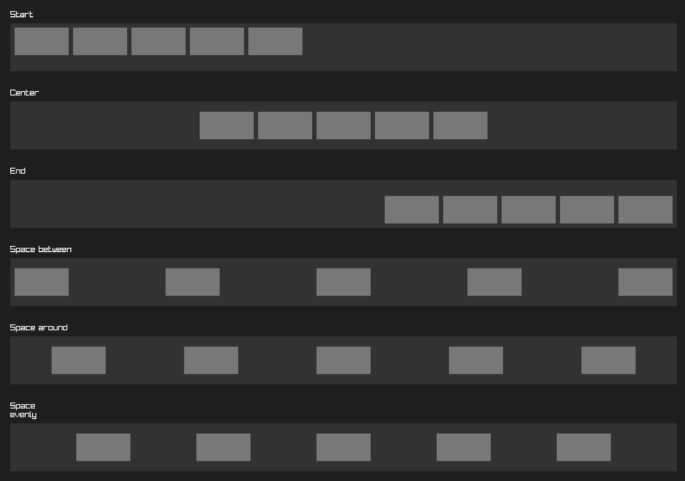

# orui

orui is an immediate mode UI library for odin and raylib, with support for flex layouts.



## Usage

Allocate the orui Context up front:

```odin
ctx := new(orui.Context)
```

In your render loop:

```odin
orui.begin(ctx, width, height)

// Declare UI here

orui.end() // The UI gets rendered here
```

## Declaring UI

### container

A container is the basic building block element for holding child elements. You can think of it like a div element in HTML.

```odin
{
  orui.container(orui.id("element ID"), config)
  // declare children inside curly brackets
}
```

The surrounding curly brackets are important! All elements inside will be children of the container. The container 'ends' when it goes out of scope at the end of the curly braces.

Or if you prefer another style:
```odin
if (orui.container(orui.id("element ID"), config)) {
  // declare children
}
```

Make sure containers always have their own scope. In the following example, label 2's parent is container B, not container A.

```odin
{
  orui.container(orui.id("container A"), config)
  orui.label(orui.id("label 1"), label1, {}) // child of container A
  orui.container(orui.id("container B"), config) // new container is child of container A
  // all elements from here to end of scope will be children of container B
  orui.label(orui.id("label 2"), label1, {}) // child of container B
}
```

#### _container

You can also use `_container` if you prefer to explicitly end containers. This variant of the container does not automatically close the element when it goes out of scope. You **must** end the element manually with `end_element()`:

```odin
orui._container(orui.id("container"), config)

// ...

orui.end_element()
```

This can be useful when building your own elements:

```odin
my_element :: proc(id: string) {
  orui._container(orui.id(id), {...})
  // children
  orui.end_element()
}

@(deferred_none=orui.end_element)
my_container :: proc(id: string) {
  orui._container(orui.id(id), {...})
}

{my_container("test")
  my_element("element 1")
}
```

### label

A label element displays text. The text will be wrapped if it's too long.

Make sure you define the font and font size in the element config.

This element does not need the surrounding curly braces because it cannot hold child elements.

```odin
orui.label(orui.id("label"), "Hello world!", config)
```

A label element can also be used as a button:

```odin
if orui.label(orui.id("button"), "Button text", {
  background_color = orui.active() ? {100, 100, 100, 255} : orui.hovered() ? {120, 120, 120, 255} : {30, 30, 30, 255},
}) {
  // handle button click
}
```

## Other functions

### hovered()

Returns true if the mouse is hovering over the current element. Should be used inside element declarations only:

```odin
orui.label(orui.id("label"), "Test", {
  background_color = orui.hovered() ? rl.RED : rl.BLACK
})
```

If you want to check the hover state of an element oustide of the element declaration, you can pass the element ID into the hovered function:

```odin
if orui.hovered("label") {
  // mouse is over the element
}
```

### active()

Returns true if the element is active (mouse down on the element). If the mouse moves off the element while the mouse is down, the element will become inactive.

```odin
orui.label(orui.id("label"), "Test", {
  background_color = orui.active() ? rl.RED : rl.BLACK
})
```

Same as the hover function, you can ask about a specific element by passing in the ID:

```odin
if orui.active("label") {
  // label is active
}
```

## Element config

The element functions take an element config where you can set any of these fields:

```odin
ElementConfig :: struct {
	// layout
	layout:           Layout,
	direction:        LayoutDirection,
	position:         Position,
	width:            Size,
	height:           Size,
	padding:          Edges,
	margin:           Edges,
	gap:              f32,
	align_main:       MainAlignment,
	align_cross:      CrossAlignment,

	// style
	background_color: rl.Color,

	// text
	has_text:         bool,
	text:             string,
	font:             ^rl.Font,
	font_size:        f32,
	color:            rl.Color,
	letter_spacing:   f32,
	line_height:      f32,

	// content layout
	align:            [2]ContentAlignment,
}
```

### layout
```odin
Layout :: enum {
	Flex,  // Default. Automatically positions children.
	None,  // Does not affect children positioning.
}
```

### direction

Only relevant if the layout is set to Flex.

```odin
LayoutDirection :: enum {
	LeftToRight,  // Default
	TopToBottom,
}
```

### position

```odin
PositionType :: enum {
	Auto,      // Default. Positioned by flex parent. Don't use this if parent is not flex.
	Absolute,  // Unaffected by parent position or place in UI tree.
	Relative,  // Positioned relative to its parent's position.
}
Position :: struct {
	type:  PositionType,
	value: rl.Vector2,
}
```

### width and height

```odin
SizeType :: enum {
	Fit,      // Element will try to fit its children
	Grow,     // Element will try to take up all extra space
	Percent,  // Element will be a percentage size of its parent
	Fixed,    // Element size will be a fixed number of pixels
}
Size :: struct {
	type:  SizeType,
	value: f32,
	min:   f32,
	max:   f32,
}
```

### padding and margin

Define pixel padding/margin for each side of the element.

```odin
Edges :: struct {
	top:    f32,
	right:  f32,
	bottom: f32,
	left:   f32,
}
```

### gap

The space between child elements in pixels. Only used for flex elements.

### align_main

Flex alignment along the main axis. Same as justify-content in css.

Main axis is the axis following the direction of the flex element.
If direction is `LeftToRight`, main axis is horizontal.
if direction is `TopToBottom`, main axis is vertical.

```odin
MainAlignment :: enum {
	Start,         // Align children to beginning of element
	End,           // Align children to end of element
	Center,        // Center the children
	SpaceBetween,  // Distribute children with equal space between them, no space at edges
	SpaceAround,   // Distribute children with equal space around each item
	SpaceEvenly,   // Distribute children with equal space between them and edges
}
```

### align_cross

Flex alignment along the cross axis. Same as align-items in css.

```odin
CrossAlignment :: enum {
	Start,   // Align children to beginning of element
	End,     // Align children to end of element
	Center,  // Center the children
}
```

### background_color

This is the background color of the element, given as a raylib Color.

If the alpha is 0, nothing is drawn. Default background color is invisible.

### has_text and text

If `text` is set, `has_text` should be set to true. The label element does this automatically.

If `text` is set, a raylib font must also be defined, and a font size.

### font

This is a raylib Font pointer. orui does not manage your fonts for you. It's up to you to pass the correct font pointer for your font size.

### font_size

Font size in pixels.

### color

Color of the text, given as a raylib Color.

### letter_spacing and line_height

Control the letter spacing and line height of the text.

Default value is 1 for both.

### align

Controls how the content is aligned. Only relevant for elements with text. Does not affect children.

An array of two alignment values. The first value is the horizontal alignment, second value is vertical alignment.

```odin
ContentAlignment :: enum {
	Start,   // Align left/top
	Center,  // Align center
	End,     // Align right/bottom
}
```

### Config helpers

Config helpers can be used in the element config as a shortcut for common values:

```odin
orui.container(orui.id("container"), {
  // equal padding on all sides, equivalent to {5, 5, 5, 5}
  padding = orui.padding(5),

  // equal margin on all sides, equivalent to {5, 5, 5, 5}
  margin = orui.margin(5),

  // fixed pixel size, equivalent to {.Fixed, 500, 0, 0}
  width/height = orui.fixed(500),

  // percent size, equivalent to {.Percent, 0.5, 0, 0}
  width/height = orui.percent(0.5),

  // fit size, equivalent to {.Fit, 0, 0, 0}
  width/height = orui.fit(),

  // grow size, equivalent to {.Grow, basis, 0, 0}. Basis is optional
  width/height = orui.grow(basis),
})
```

### Config modifiers

The container and label also take optional config modifiers, which are functions with this signature:

```odin
ElementModifier :: proc(element: ^Element)
```

The modifiers will be called to configure the element further.

This can be useful for reusable styles:

```odin
error_style :: proc(element: ^Element) {
  element.background_color = rl.RED
  element.color = rl.WHITE
}

standard_sizing :: proc(element: ^Element) {
  element.padding = {5, 10, 5, 10}
  element.margin = {5, 10, 5, 10}
}

{
  orui.container(orui.id("container"), {}, error_style, standard_sizing)
  orui.label(orui.id("label"), {}, error_style)
}
```
